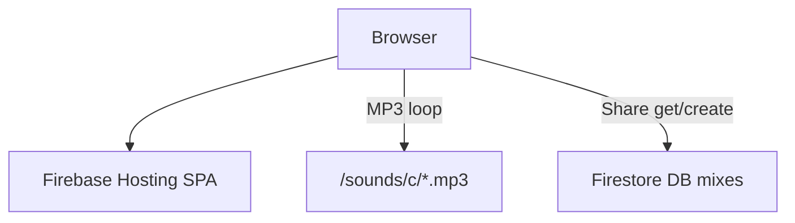
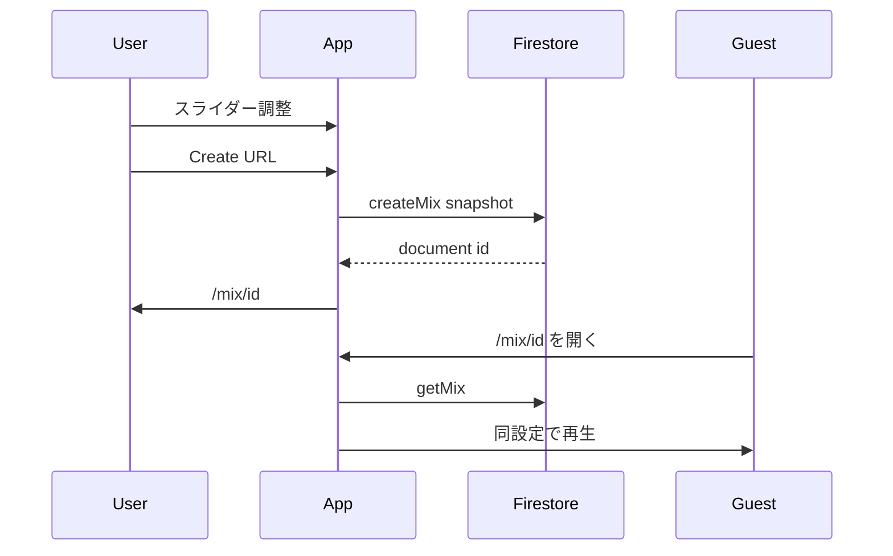

# Ambient Music Mixer

8つのレイヤーをリアルタイムにミックスして、自分だけの環境音楽（アンビエント）を作れる Web アプリです。
音楽の知識がなくても、聴きながら・触りながら環境音楽を楽しめます。
作ったミックスは URL で共有できます。

**本番:** [nii-nuxt-eno.web.app](https://nii-nuxt-eno.web.app/)

## 使い方

1. 画面をクリックして開始する
2. 8 音源の読み込みが終わるまで待つ
3. **Preset** でミックス全体のたたき台を選ぶ（最後に選んだプリセットはブラウザに保存され、次回 `/` から開いたときに復元される）
4. **Color** でカラースキンを選ぶ（Mix URL に含まれる）
5. 下段の 8 レイヤーで音量・エフェクトをスライダー調整する
6. **Mix 名（任意）** を入れて **Create URL** を押す — Firestore に保存され、**Mix URL** が画面に表示される（可能ならクリップボードにもコピーされる。**Copy** で再コピー可）。アドレスバーは `/mix/{id}` に変わる

`/mix/{id}` を別タブや再読込で開いた人は、クリック後に保存時点と同じ 8 レイヤー・エフェクト・スキンで再生できる。URL の内容はスナップショットなので、スライダーを動かしても既存 URL は変わらない。設定を変えたうえで再度 **Create URL** すると、新しい URL が発行される。

## エフェクト

| 名前 | 説明 |
| --- | --- |
| Volume | 音量を操作します |
| Filter | 高音を抑えます |
| Tremolo | 音量を周期的に変化させます |
| Vibrato | 音程を周期的に変化させます |
| Panner | 左右ステレオを周期的に変化させます |

## プリセット

| 名前 | 説明 |
| --- | --- |
| Quiet | 静かな土台に戻す。すべてのレイヤーを初期状態にする |
| Bright Air | 明るく軽やかに広がる、開放的なアンビエント |
| Dreamscape | やわらかく広がる、穏やかなアンビエント |
| Deep Focus | 集中向けの落ち着いた低域中心ミックス |
| Soft Vibe | 浮遊感と揺らぎのある、ふわっとしたミックス |
| Slow Pulse | ゆっくりうねる、呼吸のようなリズム |

## 環境音楽について

またの名をアンビエント音楽と言います。空間に添える形で提供され、微妙な音の変化に耳を傾けたり、ただ空間に漂う「音」として楽しむことを意識して作られています。ヒーリングや瞑想などにも使われます。

## 技術スタック

| 用途 | 技術 |
| --- | --- |
| フロントエンド | Nuxt.js 2（SPA / static） |
| 音声処理 | Tone.js |
| 背景アニメーション | CreateJS |
| ホスティング | Firebase Hosting |
| ミックス保存 | Cloud Firestore（DB `mixes` / `mixes/{id}`） |
| 音源配信 | Firebase Hosting（`static/sounds/c/`） |

## アーキテクチャ

### ランタイム



### 共有



## セットアップ

```bash
npm install
cp .env.example .env
npm run dev
```

## ドキュメント

| ドキュメント | 内容 |
| --- | --- |
| [docs/runbook.md](docs/runbook.md) | ローカル開発、デプロイ、音源、障害時 |
| [docs/architecture.md](docs/architecture.md) | コンポーネント、音声パイプライン、ルート |
| [docs/domain.md](docs/domain.md) | Mix / レイヤー、Firestore 形状 |
| [docs/adr.md](docs/adr.md) | 技術選定 ADR |

## 今後の構想

- アプリ上で音源を作成できる環境
- ユーザー登録・一覧・いいねなど、誰もが環境音楽を作成・ミックスできるプラットフォーム
